# Step 00: Setup

## ⚡ TL;DR

Install Ollama, pull a small model, install Node/Yarn deps, set `OLLAMA_MODEL`, `OLLAMA_MODEL_JUDGE`, and `OLLAMA_MODEL_EMBED` in `.env`, and run a smoke test that
verifies: (1) the daemon is reachable and (2) the required model is installed.

## 🚀 Quickstart

1. [Clone the repository](#1-clone-the-repository)
2. [Install Ollama](#2-install-ollama)
3. [Ensure `ollama` is running](#3-ensure-the-daemon-is-running)
4. [Pull local models](#4-pull-local-models)
5. [Set up Node.js, Yarn, and dependencies](#5-set-up-nodejs-yarn-and-dependencies)
6. [Configure environment](#6-configure-environment)
7. [Run the smoke test](#7-run-the-smoke-test)

## 🎯 Learning Outcomes

By the end of this step, you will be able to:

- Install and run a local LLM runtime using **Ollama**.
- Execute a **smoke test** (`vitest` + `ollama-js`) that verifies connectivity and that your chosen model is installed.
- Explain why an _offline-first design_ is valuable (reproducibility, latency control, data privacy).

## 🧠 Background

> [!IMPORTANT]
> **Why this matters:** A reliable local runtime removes _"works on my machine"_ variability and avoids cloud dependencies
> during learning.

**Key ideas**

- Same model artefacts for everyone → reproducible outputs
- Lower latency and no API bills
- Inputs/outputs stay on your machine

**Model flexibility:** While we use Ollama with local models in this course, the LangChain + Ollama setup supports other models too. You can:

- Use more powerful local models (larger Ollama models, or other local runtimes)
- Switch to cloud-based models (OpenAI, Anthropic, AWS Bedrock, etc.) via LangChain's model integrations
- Swap `ChatOllama` for other LangChain model classes with minimal code changes - the same patterns (prompts, chains, structured output) work across providers

See [LangChain model integrations](https://docs.langchain.com/oss/javascript/integrations/providers/overview) for available options.

**Read more:** see Further Reading in [README.md](../README.md#further-reading).

## 🔑 Prerequisites

> [!TIP]
> **Before starting:** Make sure you have all prerequisites ready to avoid interruptions during setup.

- **Operating system:** macOS, Linux, or Windows via **WSL2**
- **Tools:** Git, Node LTS, Yarn (via Corepack or global install)
- **Connectivity:** Internet access to download Ollama + model
- **Disk/RAM:** enough for a small instruct model (e.g., `llama3.1:8b`)

## 🧭 Walkthrough

> [!NOTE]
> This step is all about setup - making sure your environment is ready to run ADR generation locally. Don't worry if you've never used Ollama or local LLMs before: the checks here are simple, and the tests will confirm everything is wired up correctly.

**Note:** We'll use three models: a main language model (`OLLAMA_MODEL`) for text generation, a judge model (`OLLAMA_MODEL_JUDGE`) for AI-as-judge, and an embedding model (`OLLAMA_MODEL_EMBED`) for vector operations. All are required.

### 1. Clone the repository

Clone the project and navigate to the directory:

```bash
git clone https://github.com/ocean-internet/masterclass-ai-fluency-for-builders.git
cd masterclass-ai-fluency-for-builders
```

Verify you're on the `main` branch:

```bash
git checkout main
```

**Expected:** You're in the project directory and on the `main` branch.

### 2. Install Ollama

#### macOS

Download and install: https://ollama.com/download

#### Linux

```bash
curl -fsSL https://ollama.com/install.sh | sh
```

If needed, start the service:

```bash
systemctl --user start ollama
```

#### Windows (via WSL2)

1. Install WSL: https://learn.microsoft.com/en-us/windows/wsl/install
2. Inside WSL (Ubuntu recommended), follow the Linux steps above.

**Expected:** `ollama` is on your PATH.

### 3. Ensure the daemon is running

Check if Ollama is running:

```bash
curl -f http://localhost:11434/api/version
```

**Expected:** Command returns JSON with version info (e.g., `{"version":"0.13.1"}`) and exits with status 0, confirming the daemon is reachable.

> **Troubleshooting:** If you get a "connection refused" error, see [Troubleshooting](#%EF%B8%8F-troubleshooting) below.

### 4. Pull local models

```bash
ollama pull llama3.1:8b
ollama pull qwen2.5:7b
ollama pull nomic-embed-text
```

**Expected:** download completes; `ollama list` shows `llama3.1:8b`, `qwen2.5:7b`, and `nomic-embed-text`.

### 5. Set up Node.js, Yarn, and dependencies

> [!TIP]
> **Recommended approach:** Using **nvm** + **Corepack** ensures you're using the correct Node version and Yarn version specified in the project.

```bash
nvm install && nvm use   # installs/uses the .nvmrc or latest LTS
corepack enable          # enables Yarn bundled with Node
yarn install             # installs package.json dependencies
```

(If you prefer global Yarn: `npm i -g yarn && yarn`.)

**Expected:** dependencies install successfully.

### 6. Configure environment

Copy the example and set your default model:

```bash
cp .env.example .env
```

#### .env

```env
# The local models you expect to be present
OLLAMA_MODEL=llama3.1:8b
OLLAMA_MODEL_JUDGE=qwen2.5:7b
OLLAMA_MODEL_EMBED=nomic-embed-text

# Optional: override host (e.g., WSL/remote)
# OLLAMA_HOST=http://127.0.0.1:11434
```

**Expected:** `.env` exists and includes `OLLAMA_MODEL=llama3.1:8b`, `OLLAMA_MODEL_JUDGE=qwen2.5:7b`, and `OLLAMA_MODEL_EMBED=nomic-embed-text` (or your choices).

### 7. Run the smoke test

Run the smoke test to verify your environment is configured correctly:

```bash
yarn test:smoke
```

**Expected:**

- Tests connect to the Ollama daemon.
- Tests confirm `OLLAMA_MODEL`, `OLLAMA_MODEL_JUDGE`, and `OLLAMA_MODEL_EMBED` are installed.
- Clear failure messages if any check fails (no side effects).

> [!TIP]
> **Test commands:**
> - `yarn test:smoke` - Run smoke tests (pre-flight/environment checks that verify your setup is correct, e.g., Ollama connectivity, models loaded)
> - `yarn test:unit` - Run unit tests only (fast, isolated tests that don't require external services)
> - `yarn test:e2e` - Run end-to-end tests (tests that exercise full workflows with real LLM calls)
> - `yarn test` - Run full test suite (smoke + unit + e2e)

> Reference test file: [env.smoke.test.ts](../src/env.smoke.test.ts)

## ✅ Checklist

- ⬜ Ollama installed and running (`curl -f http://localhost:11434/api/version` returns version JSON)
- ⬜ Models pulled (`ollama list` shows both `llama3.1:8b` and `nomic-embed-text`, or your chosen models)
- ⬜ `yarn install` completes without error
- ⬜ `.env` contains `OLLAMA_MODEL=llama3.1:8b`, `OLLAMA_MODEL_JUDGE=qwen2.5:7b`, and `OLLAMA_MODEL_EMBED=nomic-embed-text` (or your choices)
- ⬜ `yarn test` passes (all 3 tests: connectivity, model presence, and llm generation)
- ⬜ I can explain why _offline-first_ matters

## ➡️ Next

> [!IMPORTANT]
> **Before moving on:** Complete the checklist above to ensure your environment is fully configured and tested.

With your environment ready, you're set to generate your very first ADR.

```bash
git checkout step-01-single-prompt
```

Continue to **Step 01 - Single Prompt** ([STEP_01_SINGLE_PROMPT.md](STEP_01_SINGLE_PROMPT.md)).

## 🛠️ Troubleshooting

> [!CAUTION]
> **If you encounter issues:** Check the troubleshooting section below before asking for help. Most setup issues are resolved by following these steps.

### Fix "Connection Refused" Error

If you see `curl: (7) Failed to connect to localhost port 11434 after 0 ms: Connection refused`:

1. **Try `127.0.0.1` instead of `localhost`:**

   ```bash
   curl -f http://127.0.0.1:11434/api/version
   ```

   If you see version JSON, it works. Skip to step 3.

2. **If you still get "connection refused," start Ollama:**
   - **macOS**: `ollama serve` (or open the Ollama app)
   - **Linux/WSL**: `systemctl --user start ollama`

   Then run the curl command from step 1 again.

3. **If it works, update your `.env` file:**

   ```env
   OLLAMA_HOST=http://127.0.0.1:11434
   ```

4. **If it still doesn't work:**
   - Check if Ollama is running: `ps aux | grep ollama` (macOS/Linux) or `systemctl --user status ollama` (Linux)
   - Check if port 11434 is in use: `lsof -i :11434` (macOS) or `netstat -tuln | grep 11434` (Linux)

**What "connection refused" means:** Your computer is reachable, but nothing is listening on port 11434. This usually means Ollama isn't running.

### Other Issues

- **Model won't load** → insufficient RAM/VRAM → try a smaller quantised build (e.g., `llama3.1:8b-instruct:q4_0`).
- **Node/Yarn issues** → confirm `node -v` (LTS); run `corepack enable` before `yarn install`.

## 📊 Model Configuration Matrix

This section provides guidance on model selection for each use case, including more powerful local and cloud alternatives.

| Model Variable | Use Case | Default (Current) | More Powerful Local | More Powerful Cloud |
|----------------|----------|-------------------|---------------------|---------------------|
| `OLLAMA_MODEL` | ADR generation / Text generation | `llama3.1:8b` | `llama3.1:70b` or `qwen2.5:72b` | `claude-3-5-sonnet` (Anthropic) or `gpt-4`/`gpt-4-turbo` (OpenAI) |
| `OLLAMA_MODEL_JUDGE` | Evaluation / Scoring | `qwen2.5:7b` | `qwen2.5:72b` or `llama3.1:70b` | `claude-3-5-sonnet` (Anthropic) or `gpt-4` (OpenAI) |
| `OLLAMA_MODEL_EMBED` | Text embeddings | `nomic-embed-text` | `mxbai-embed-large` or `bge-m3` | `text-embedding-3-large` (OpenAI) or `voyage-large-3` (Voyage AI) |

### Switching to Cloud Models

To switch from local Ollama models to cloud-based models, replace `ChatOllama` with the appropriate LangChain integration:

**OpenAI Example:**

```typescript
import { ChatOpenAI } from "@langchain/openai";

// Replace ChatOllama with ChatOpenAI
const model = new ChatOpenAI({
  modelName: "gpt-4",
  temperature: 0,
});
```

**Anthropic Example:**

```typescript
import { ChatAnthropic } from "@langchain/anthropic";

// Replace ChatOllama with ChatAnthropic
const model = new ChatAnthropic({
  modelName: "claude-3-5-sonnet-20241022",
  temperature: 0,
});
```

**Voyage AI Embeddings Example:**

```typescript
import { VoyageEmbeddings } from "@langchain/voyageai";

// Replace OllamaEmbeddings with VoyageEmbeddings
const embeddings = new VoyageEmbeddings({
  modelName: "voyage-large-3",
});
```

> [!NOTE]
> **Trade-offs:**
> - **Local models**: Privacy, no API costs, works offline, but may have lower quality
> - **Cloud models**: Better quality, but requires internet, incurs API costs, data sent to provider
>
> **Model availability:** Verify Ollama model availability with `ollama list` or check the [Ollama library](https://ollama.com/library). Some models may need to be pulled manually or may not be available in the Ollama library.

See [LangChain model integrations](https://docs.langchain.com/oss/javascript/integrations/providers/overview) for all available options.

## 🏗️ Local vs Cloud Model Architecture

The following diagram illustrates how local and cloud model architectures differ, showing what runs on your local machine versus what runs in the cloud:

```mermaid
---
title: Local Architecture
---
graph
    subgraph localMachine["🖥️ Your Local Machine"]
        A[Your Application<br/>LangChain.js]
        B[Ollama Daemon<br/>Local Runtime]
        C[Model Files<br/>llama3.1:8b<br/>Stored on Disk]
        A -->|HTTP API| B
        B -->|Runs| C
    end
```




**Key differences:**

- **Local (Ollama)**: All components run on your machine. Models are stored locally, no internet required after initial download, no API costs, complete data privacy.
- **Cloud (OpenAI/Anthropic)**: Your application communicates with remote APIs over the internet. Models run on provider servers, requires internet connection, incurs API costs, data sent to provider.

Both architectures use the same LangChain patterns (prompts, chains, structured output), making it easy to switch between local and cloud models.
