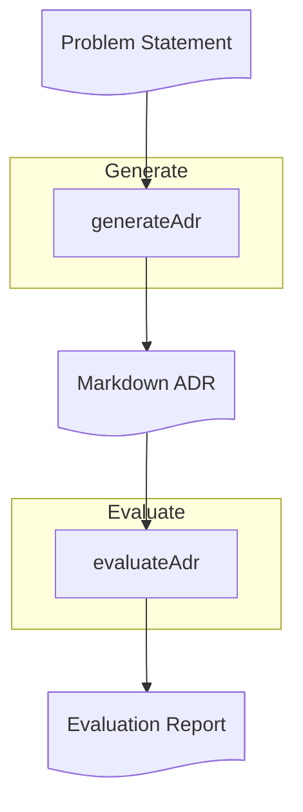

# Step 01: Single Prompt

## ⚡ TL;DR

Generate an ADR in one LLM call, validate it with Zod, then have another LLM evaluate it. Learn why evaluation is foundational - not optional - for trusting AI outputs.

> **Getting Started**
>
> - Ensure you've completed Step 00 - Setup ([STEP_00_SETUP.md](./STEP_00_SETUP.md))
> - Checkout the branch: `git checkout step-01-single-prompt`
> - Run `yarn install` to ensure dependencies are up to date
> - Verify Ollama is running: `curl -f http://localhost:11434/api/version`
> - Verify `.env` is configured with `OLLAMA_MODEL` and `OLLAMA_MODEL_JUDGE`

## 🎯 Learning Outcomes

By the end of this step, you will be able to:

- Generate structured output (JSON) from a single prompt using LangChain + Ollama
- Validate LLM responses with Zod schemas before use
- Use an LLM as a judge to evaluate generated content (basic eval: clear, justified, comprehensive, actionable)
- Understand the Generate → Evaluate → Iterate pattern that scales to all sophistication levels
- Recognize that "AI drafts, humans decide" - evaluation helps you trust, not blindly accept

## 🧠 Background

> [!IMPORTANT]
> **Why this matters:** This is the simplest useful AI-augmented workflow. No chains, no retrieval, no complexity. Just: generate something, evaluate it, iterate on it. This pattern works at every level.

**Key ideas**

- **Evaluation is foundational**: Not a nice-to-have, but the mechanism that lets you trust AI outputs
- **Structured output enables validation**: JSON + Zod catches errors before they propagate
- **LLM-as-judge pattern**: Use AI to critique AI - this scales to any domain
- **The loop**: Generate → Evaluate → Iterate. You'll use this same pattern in Steps 02 and 03

**Model flexibility:** While we use [ChatOllama](https://docs.langchain.com/oss/javascript/integrations/chat/ollama) with [local models](https://docs.langchain.com/oss/javascript/langchain/models#local-models), you can swap it for other LangChain model integrations (OpenAI, Anthropic, AWS Bedrock, etc.) with minimal code changes. The same patterns (prompts, structured output, evaluation) work across different model providers. See [LangChain model integrations](https://docs.langchain.com/oss/javascript/integrations/providers/overview) for options.

**Read more:** [MADR template](https://adr.github.io/madr/), [Architecture Decision Records (Martin Fowler)](https://martinfowler.com/articles/scaling-architecture-conversationally.html#adr)

## 📚 LangChain Concepts

This step introduces several key LangChain concepts:

- **[ChatPromptTemplate](https://reference.langchain.com/javascript/classes/_langchain_core.prompts.ChatPromptTemplate.html)** - Create structured prompts with placeholders for dynamic content
- **[Structured Output](https://docs.langchain.com/oss/javascript/langchain/models#structured-output)** - Use `withStructuredOutput()` to get JSON responses validated against Zod schemas
- **[Ollama Integration](https://docs.langchain.com/oss/javascript/integrations/chat/ollama)** - `ChatOllama` class for connecting to local Ollama models

## 📊 Workflow Diagram



## 🔑 Prerequisites

> [!TIP]
> **Before starting:** Make sure you have completed Step 00 and have all prerequisites ready to avoid interruptions.

- Complete **Step 00 - Setup** ([STEP_00_SETUP.md](./STEP_00_SETUP.md))
- Ollama running with model pulled
- `.env` configured
- Dependencies installed (`yarn install`)

## 🧭 Walkthrough

> [!NOTE]
> This step introduces the foundational pattern: Generate → Evaluate → Iterate. You'll generate an ADR with a single prompt, then have another LLM evaluate it. Both outputs are validated with Zod to catch errors early.

**Note:** The evaluation step is not optional - it's the mechanism that lets you trust AI outputs. This pattern scales to all sophistication levels.

### 1. Generate the ADR

```bash
yarn adr generate src/__fixtures__/example-context.md
```

**Expected:** ADR saved to `docs/decisions/drafts/0000-{{ADR TITLE}}.md` with valid structure. The command prints the filename on success.

> [!NOTE]
> **About CLI commands:** The `yarn adr generate` and `yarn adr evaluate` commands are debugging/scaffolding tools provided for convenience. The actual LLM logic lives in the step functions (`generateAdr`, `evaluateAdr` in `src/step01/`) which can be called programmatically from your own code. These CLI commands wrap the functions to make testing and iteration easier.

Open the generated file and review it. What looks good? What's missing or wrong?

### 2. Evaluate the ADR

```bash
yarn adr evaluate docs/decisions/drafts/0000-{{ADR TITLE}}.md
```

Replace `0000-{{ADR TITLE}}.md` with the actual filename from step 1.

**Expected:** Evaluation saved to `docs/decisions/drafts/0000-{{ADR TITLE}}.eval.md` with scores (clear, justified, comprehensive, actionable, average) and suggestions.

### 3. Review and reflect

Open both files (the ADR and its evaluation).

- Compare the evaluator's scores to your own assessment. Do you agree?
- What did the evaluator catch that you might have missed?
- What's still wrong that neither the generator nor evaluator caught?
- How would you iterate on this? (This sets up Step 02's improvements)

### 4. Iterate on the prompt

The evaluation feedback is your guide to improving the prompt. This is the core skill: using evaluation to drive iteration.

**How to use evaluation feedback:**

- **Low clear score?** Add more structure to the prompt. Be explicit about what "clear" means in your context.
- **Low justified score?** Ask for stronger rationale and evidence; request explicit reasons tied to drivers.
- **Low comprehensive score?** List the required sections more explicitly. Add a checklist format.
- **Low actionable score?** Ask for concrete next steps and consequences; tie actions to constraints.

**Example iteration:**

If the evaluation says "tradeoffs are superficial," you might modify `src/prompts/generate-adr-minimal.md` to add:

```markdown
For each considered option, explicitly analyse:

- What problems does this option solve?
- What new problems or constraints does it introduce?
- What assumptions does it make?
```

Then re-run generation and evaluation to see if the comprehensive or justified score improves.

**Key principle:** Make one change at a time. This lets you see which prompt modifications actually improve the output. Iteration is the core skill - you're learning to guide AI, not just accept its first attempt.

## ✅ Checklist

- ⬜ ADR generated successfully (valid JSON → validated by Zod → converted to MADR format)
- ⬜ Evaluation generated successfully (valid JSON → validated by Zod → evaluation report)
- ⬜ I understand each evaluation score (clear, justified, comprehensive, actionable)
- ⬜ I can identify at least one issue the evaluator found
- ⬜ I can identify at least one issue neither the generator nor evaluator caught
- ⬜ I understand this is the foundation - Steps 02 and 03 will improve generation, but evaluation remains central
- ⬜ I can explain why evaluation is foundational, not optional

## ➡️ Next

> [!IMPORTANT]
> **Before moving on:** Complete the checklist above to ensure you understand the Generate → Evaluate → Iterate pattern.

Step 02 introduces sequential chains that improve generation quality, but uses the same evaluation pattern. The Generate → Evaluate → Iterate loop remains the backbone.

```bash
git checkout step-02-sequential-chain
```

Continue to **Step 02 - Sequential Chain** ([STEP_02_SEQUENTIAL_CHAIN.md](STEP_02_SEQUENTIAL_CHAIN.md))

For next steps specific to single-prompt approaches, see [Taking Single Prompt Further](STEP_04_WHAT_NEXT.md#taking-single-prompt-further) in What Next.

## 🛠️ Troubleshooting

> [!CAUTION]
> **If you encounter issues:** Check the troubleshooting section below before asking for help. Most issues are resolved by following these steps.

- **Validation errors** → Check prompt template for typos → Fix `src/prompts/generate-adr-minimal.md`
- **Ollama connection errors** → Verify daemon running → `curl -f http://localhost:11434/api/version`
- **Model not found** → Check `.env` → `ollama pull <model>`
- **Evaluation fails** → Check ADR file path is correct → Verify ADR file exists

### Common Mistakes

> [!WARNING]
> **Common mistakes to avoid:** The following mistakes can prevent you from getting the most out of this step.

- **Forgetting to validate outputs**: Zod validation catches errors early. If you see validation errors, the LLM output didn't match the expected schema - check your prompt template for mismatches.

- **Not reviewing evaluation scores**: The evaluation is meant to guide iteration. Don't just generate and move on - use the scores and suggestions to improve your prompt.

- **Over-editing prompts too quickly**: Make one change at a time. This lets you see which modifications actually improve the output. Multiple changes at once make it hard to know what worked.

- **Ignoring evaluation suggestions**: The LLM-as-judge often catches real issues you might miss. If the evaluator suggests improvements, try them - this is the pattern working as intended.

- **Not saving intermediate outputs**: Keep drafts of your ADRs and evaluations. Compare iterations to see how prompt changes affect output quality.
