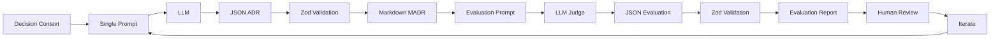

# Step 01: Single Prompt

**Branch**: `step-01-single-prompt`  
**Goal**: Generate an ADR from a decision context using a single prompt, then evaluate it with a basic LLM-as-judge. Both outputs validated with Zod. This establishes the Generate → Evaluate → Iterate pattern.

---

## ⚡ TL;DR

Generate an ADR in one LLM call, validate it with Zod, then have another LLM evaluate it. Learn why evaluation is foundational — not optional — for trusting AI outputs.

---

## 🎯 Learning Outcomes

By the end of this step, you will be able to:

- Generate structured output (JSON) from a single prompt using LangChain + Ollama
- Validate LLM responses with Zod schemas before use
- Use an LLM as a judge to evaluate generated content (basic eval: clarity, completeness, tradeoffs)
- Understand the Generate → Evaluate → Iterate pattern that scales to all sophistication levels
- Recognize that "AI drafts, humans decide" — evaluation helps you trust, not blindly accept

---

## 🧠 Background

**Why this matters:** This is the simplest useful AI-augmented workflow. No chains, no retrieval, no complexity. Just: generate something, evaluate it, iterate on it. This pattern works at every level.

**Key ideas**

- **Evaluation is foundational**: Not a nice-to-have, but the mechanism that lets you trust AI outputs
- **Structured output enables validation**: JSON + Zod catches errors before they propagate
- **LLM-as-judge pattern**: Use AI to critique AI—this scales to any domain
- **The loop**: Generate → Evaluate → Iterate. You'll use this same pattern in Steps 02 and 03

**Read more:** [MADR template](https://adr.github.io/madr/), [Architecture Decision Records (Martin Fowler)](https://martinfowler.com/articles/architecture-decision-records.html)

---

## 📊 Workflow Diagram



---

## 🔑 Prerequisites

- Complete **Step 00 - Setup** ([STEP_00_SETUP.md](./STEP_00_SETUP.md))
- Ollama running with model pulled
- `.env` configured
- Dependencies installed (`yarn install`)

---

## 🧭 Walkthrough

This step introduces the foundational pattern: Generate → Evaluate → Iterate. You'll generate an ADR with a single prompt, then have another LLM evaluate it. Both outputs are validated with Zod to catch errors early.

**Note:** The evaluation step is not optional — it's the mechanism that lets you trust AI outputs. This pattern scales to all sophistication levels.

### 1. Generate the ADR

```bash
yarn tsx src/step01/generate-adr.ts src/step01/__fixtures__/example-context.md
```

**Expected:** ADR saved to `docs/decisions/drafts/NNNN-*.md` with valid structure. The command prints the filename on success.

Open the generated file and review it. What looks good? What's missing or wrong?

### 2. Evaluate the ADR

```bash
yarn tsx src/step01/evaluate-adr.ts docs/decisions/drafts/NNNN-*.md
```

Replace `NNNN-*.md` with the actual filename from step 1.

**Expected:** Evaluation saved to `docs/decisions/drafts/NNNN-*.eval.md` with scores (clarity, completeness, tradeoffs, decision rationale, average) and suggestions.

### 3. Review and reflect

Open both files (the ADR and its evaluation).

- Compare the evaluator's scores to your own assessment. Do you agree?
- What did the evaluator catch that you might have missed?
- What's still wrong that neither the generator nor evaluator caught?
- How would you iterate on this? (This sets up Step 02's improvements)

### 4. Iterate on the prompt

The evaluation feedback is your guide to improving the prompt. This is the core skill: using evaluation to drive iteration.

**How to use evaluation feedback:**

- **Low clarity score?** Add more structure to the prompt. Be explicit about what "clear" means in your context.
- **Low tradeoffs score?** Explicitly ask for tradeoff analysis. Add examples of good tradeoff discussions.
- **Low completeness score?** List the required sections more explicitly. Add a checklist format.
- **Low rationale score?** Ask for specific justification criteria. Reference decision drivers or constraints.

**Example iteration:**

If the evaluation says "tradeoffs are superficial," you might modify `src/step01/prompts/adr-prompt.md` to add:

```markdown
For each considered option, explicitly analyze:

- What problems does this option solve?
- What new problems or constraints does it introduce?
- What assumptions does it make?
```

Then re-run generation and evaluation to see if the tradeoffs score improves.

**Key principle:** Make one change at a time. This lets you see which prompt modifications actually improve the output. Iteration is the core skill—you're learning to guide AI, not just accept its first attempt.

---

## ✅ Checklist

- ⬜ ADR generated successfully (valid JSON → validated by Zod → converted to MADR format)
- ⬜ Evaluation generated successfully (valid JSON → validated by Zod → evaluation report)
- ⬜ I understand each evaluation score (clarity, completeness, tradeoffs, decision rationale)
- ⬜ I can identify at least one issue the evaluator found
- ⬜ I can identify at least one issue neither the generator nor evaluator caught
- ⬜ I understand this is the foundation—Steps 02 and 03 will improve generation, but evaluation remains central
- ⬜ I can explain why evaluation is foundational, not optional

---

## 🛠️ Troubleshooting

- **Validation errors** → Check prompt template for typos → Fix `src/step01/prompts/adr-prompt.md`
- **Ollama connection errors** → Verify daemon running → `curl -f http://localhost:11434/api/version`
- **Model not found** → Check `.env` → `ollama pull <model>`
- **Evaluation fails** → Check ADR file path is correct → Verify ADR file exists

### Common Mistakes

- **Forgetting to validate outputs**: Zod validation catches errors early. If you see validation errors, the LLM output didn't match the expected schema—check your prompt template for mismatches.

- **Not reviewing evaluation scores**: The evaluation is meant to guide iteration. Don't just generate and move on—use the scores and suggestions to improve your prompt.

- **Over-editing prompts too quickly**: Make one change at a time. This lets you see which modifications actually improve the output. Multiple changes at once make it hard to know what worked.

- **Ignoring evaluation suggestions**: The LLM-as-judge often catches real issues you might miss. If the evaluator suggests improvements, try them—this is the pattern working as intended.

- **Not saving intermediate outputs**: Keep drafts of your ADRs and evaluations. Compare iterations to see how prompt changes affect output quality.

---

## ➡️ Next

Step 02 introduces sequential chains that improve generation quality, but uses the same evaluation pattern. The Generate → Evaluate → Iterate loop remains the backbone.

Continue to **Step 02 — Sequential Chain**

```bash
git checkout step-02-sequential-chain
```
