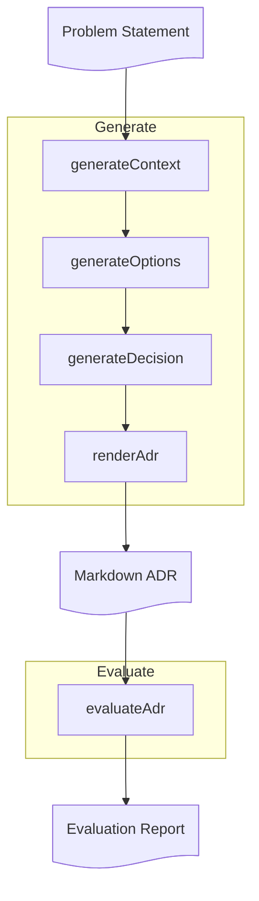

# Step 02: Sequential Chain

**Branch**: `step-02-sequential-chain`  
**Goal**: Generate an ADR using a 4-stage sequential chain, where each stage produces validated JSON that accumulates into working memory, then renders to markdown for the next stage. Uses the same evaluation as Step 01 to compare approaches.

---

## ⚡ TL;DR

Break ADR generation into 4 stages (Context+Drivers → Options+ProsCons → Decision → Final), each producing validated JSON that accumulates into working memory. Each stage renders its output to markdown for the next stage's input. Final stage renders complete ADR template. Use the same evaluation from Step 01 to compare chain vs one-shot scores.

---

## 🎯 Learning Outcomes

By the end of this step, you will be able to:

- Build multi-step chains that break complex tasks into simpler stages
- Validate intermediate outputs with Zod schemas before passing to next stage
- Accumulate structured data in working memory across chain stages
- Use markdown partials to provide human-readable context to LLM stages
- Understand the trade-off: more complexity (chains) but often better quality
- Compare chain vs one-shot approaches using the same evaluation criteria

---

## 🧠 Background

**Why this matters:** Sequential chains break complex tasks into stages, each with its own prompt and validation. This enables intermediate validation (catch errors early), better reasoning (LLM focuses on one task at a time), and improved quality (each stage builds on previous output).

**Key ideas**

- **Multi-step reasoning**: Break complex tasks into simpler steps (like writing code: function by function)
- **Intermediate validation**: Check each step works before moving on (like unit tests)
- **Working memory pattern**: Accumulate structured JSON data across stages
- **Hybrid approach**: LLM sees markdown (natural), we validate JSON (structured)
- **Trade-off**: More complexity, but often better quality

**Read more:** [LangChain chains documentation](https://js.langchain.com/docs/modules/chains/), [Using generative AI as an architect buddy for creating architecture decision records](https://handsonarchitects.com/blog/2025/using-generative-ai-as-architect-buddy-for-adrs/)

---

## 📊 Workflow Diagram



---

## 🔑 Prerequisites

- Complete **Step 00 - Setup** ([STEP_00_SETUP.md](./STEP_00_SETUP.md))
- Complete **Step 01 - Single Prompt** ([STEP_01_SINGLE_PROMPT.md](./STEP_01_SINGLE_PROMPT.md))
- Ollama running with model pulled
- `.env` configured
- Dependencies installed (`yarn install`)

---

## 🧭 Walkthrough

This step introduces sequential chains: breaking ADR generation into 4 stages, each producing validated JSON that accumulates into working memory. Each stage renders its output to markdown for the next stage's input.

**Note:** Each stage is independently runnable. You can test stages individually or run the full chain.

### 1. Generate the ADR using the full chain

```bash
yarn adr generate src/step01/__fixtures__/example-context.md
```

**Expected:** ADR saved to `docs/decisions/drafts/NNNN-*.md` with full template structure (Context, Decision Drivers, Options, Pros/Cons, Decision, Consequences). The command prints the filename on success.

Open the generated file and review it. Compare it to the Step 01 output. What's different? What's better?

### 2. Run stages independently (optional)

Each stage can be run standalone for testing or debugging:

**Stage 1: Context + Decision Drivers**

```bash
yarn adr context src/step01/__fixtures__/example-context.md > context-output.md
```

**Stage 2: Options + Pros/Cons** (requires Stage 1 JSON output)

```bash
# First, generate context JSON, then:
yarn adr context src/step01/__fixtures__/example-context.md | jq . > context.json
yarn adr options context.json > options.json
```

**Stage 3: Decision** (requires Context and Options JSON)

```bash
yarn adr decision context.json options.json > decision.json
```

**Stage 4: Render Final ADR** (requires AdrData JSON)

```bash
# Combine context, options, and decision into AdrData format, then:
yarn adr render adr-data.json > final-adr.md
```

### 3. Evaluate the ADR (same as Step 01)

```bash
yarn adr evaluate docs/decisions/drafts/NNNN-*.md
```

Replace `NNNN-*.md` with the actual filename from step 1.

**Expected:** Evaluation saved to `docs/decisions/drafts/NNNN-*.eval.md` with scores (clarity, justified, comprehensive, actionable) and suggestions.

### 4. Compare chain vs one-shot

Open both ADR files (Step 01 one-shot and Step 02 chain) and their evaluations:

- Did the chain approach produce better scores?
- Which criteria improved most? (clarity, justified, comprehensive, actionable)
- What's still missing or wrong?
- How does the full template (Decision Drivers, Pros/Cons) compare to the minimal template?

### 5. Iterate on stage prompts

The evaluation feedback guides improvements. Since each stage has its own prompt, you can target specific issues:

- **Low clarity score?** Improve Stage 1 (context) or Stage 3 (decision) prompts
- **Low comprehensive score?** Improve Stage 2 (options + pros/cons) prompt
- **Low actionable score?** Improve Stage 3 (decision + consequences) prompt

**Key principle:** Make one change at a time. Test the full chain after each change to see which modifications actually improve the output.

---

## ✅ Checklist

- ⬜ ADR generated successfully using full chain (4 stages: context → options → decision → final)
- ⬜ Each stage produces valid JSON (validated with Zod)
- ⬜ Working memory accumulates correctly across stages
- ⬜ Final ADR includes all sections: Context, Decision Drivers, Options, Pros/Cons, Decision, Consequences
- ⬜ Evaluation generated successfully (same schema as Step 01)
- ⬜ I can compare chain vs one-shot scores
- ⬜ I understand that intermediate validation catches errors early
- ⬜ I can explain the trade-off: more complexity (chains) but often better quality

---

## ➡️ Next

Step 03 introduces retrieval-augmented generation (RAG) that adds real-world context to ADR generation, but uses the same evaluation pattern. The Generate → Evaluate → Iterate loop remains the backbone.

```bash
git checkout step-03-retrieval-augmented-generation
```

Continue to **Step 03 - Retrieval-Augmented Generation** ([STEP_03_RETRIEVAL_AUGMENTED_GENERATION.md](STEP_03_RETRIEVAL_AUGMENTED_GENERATION.md))

---

## 🛠️ Troubleshooting

- **Validation errors at a stage** → Check that stage's prompt matches its schema → Fix `src/step02/stageXX-*/prompt.md`
- **Ollama connection errors** → Verify daemon running → `curl -f http://localhost:11434/api/version`
- **Model not found** → Check `.env` → `ollama pull <model>`
- **Stage fails** → Run that stage independently to isolate the issue → Check stage's `index.ts` and `schema.ts`
- **Working memory validation fails** → Check that all stages merged correctly → Verify `generate-adr-chain.ts` merging logic

### Common Mistakes

- **Schema mismatches between stages**: Each stage's prompt must match its schema. If Stage 2 expects `prosCons` but prompt asks for `options`, validation will fail.

- **Not validating intermediate outputs**: Each stage validates its JSON output before merging into working memory. If validation fails, the error message should indicate which stage and which field.

- **Mixing up markdown partials**: Each stage renders its output to markdown for the next stage. Make sure you're passing the correct partial (accumulated from previous stages) to each stage.

- **Over-editing multiple stages at once**: Make one change at a time. Test the full chain after each change to see which modifications actually improve the output.
