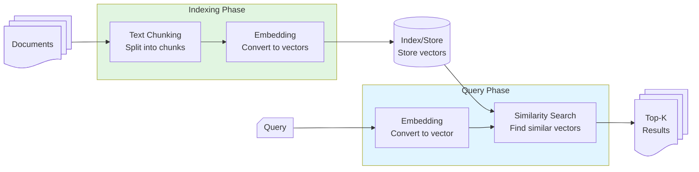

# Step 03: Retrieval-Augmented Generation

## ⚡ TL;DR

Load PDFs into a vector store (persisted to disk), retrieve the most relevant chunks for your decision context, and feed them into options generation. Run the full chain: `context → options-03 → decision → render`, then evaluate with the same rubric as Steps 01 - 02.

> **Getting Started**
>
> - Ensure you've completed Step 00 - Setup ([STEP_00_SETUP.md](./STEP_00_SETUP.md))
> - Checkout the branch: `git checkout step-03-retrieval-augmented-generation`
> - Run `yarn install` to ensure dependencies are up to date
> - Verify Ollama is running: `curl -f http://localhost:11434/api/version`
> - Verify `.env` is configured with `OLLAMA_MODEL`, `OLLAMA_MODEL_JUDGE`, and `OLLAMA_MODEL_EMBED`
> - Ensure PDFs are in `docs/source-pdfs/` directory
> - Run `yarn test:smoke` to verify PDFs are present

> [!TIP]
> **Where the code lives:** The implementation for this step is in `src/step03/`. Key functions to explore:
> - [`loadDocuments()`](../src/step03/retrieval/load-documents.ts) - Loads PDFs from `docs/source-pdfs/`
> - [`createVectorStore()`](../src/step03/retrieval/create-vector-store.ts) - Builds the vector store from documents
> - [`retrieveContext()`](../src/step03/retrieval/retrieve-context.ts) - Retrieves relevant chunks for a query
> - [`generateOptions()`](../src/step03/options/generate.ts) - Generates options with retrieved context
> - [`generateAdr()`](../src/step03/generate-adr.ts) - Orchestrates the RAG-augmented chain
>
> Open these files to understand how retrieval-augmented generation works.

## 🎯 Learning Outcomes

By the end of this step, you will be able to:

- Load and chunk PDFs, embed them, and perform top-k similarity search with LangChain.
- Augment prompts with retrieved context while keeping structured outputs validated by Zod.
- Run a retrieval-augmented chain that reuses existing evaluation to compare quality across steps.

## 🧠 Background

> [!IMPORTANT]
> **Why this matters:** Retrieval grounds the LLM in a real context. You keep the familiar Generate → Evaluate → Iterate loop, but with better inputs.

**Key ideas**

- Retrieval adds context; evaluation stays the same (clear, justified, comprehensive, actionable).
- Keep it simple: vector store persisted to disk, top-k search, no reranking.
- Follow-along git tutorial; confidence builder, not a test.

## 📚 LangChain Concepts

This step introduces retrieval-augmented generation (RAG):

- **[RAG](https://docs.langchain.com/oss/javascript/langchain/rag)** - RAG concepts and retrieval patterns
- **[Vector Stores](https://docs.langchain.com/oss/javascript/integrations/vectorstores/faiss/)** - `FaissStore` for local vector storage and similarity search
- **[Document Loaders](https://docs.langchain.com/oss/javascript/integrations/document_loaders/file_loaders/pdf)** - `PDFLoader` for loading PDF documents
- **[Text Splitters](https://docs.langchain.com/oss/javascript/integrations/splitters/recursive_text_splitter)** - `RecursiveCharacterTextSplitter` for chunking documents
- **[Ollama Embeddings](https://docs.langchain.com/oss/javascript/integrations/text_embedding/ollama/)** - `OllamaEmbeddings` for generating embeddings
- **[Runnables](https://reference.langchain.com/javascript/modules/_langchain_core.runnables.html)** - Chain composition (introduced in Step 02; see [RunnablePassthrough](https://reference.langchain.com/javascript/classes/_langchain_core.runnables.RunnablePassthrough.html) and [RunnableLambda](https://reference.langchain.com/javascript/classes/_langchain_core.runnables.RunnableLambda.html))

## 📊 Workflow Diagram


## 🔑 Prerequisites

> [!TIP]
> **Before starting:** Make sure you have downloaded the required PDFs and placed them in the correct directory. The vector store will be built automatically on first run.

- PDFs placed at `docs/source-pdfs/` directory. Download the following PDFs and place them in this directory:
  - [Cloud design patterns, architectures, and implementations](https://docs.aws.amazon.com/pdfs/prescriptive-guidance/latest/cloud-design-patterns/cloud-design-patterns.pdf)
  - [Agentic AI patterns and workflows on AWS](https://docs.aws.amazon.com/pdfs/prescriptive-guidance/latest/agentic-ai-patterns/agentic-ai-patterns.pdf)
  - [AWS Well-Architected Framework](https://docs.aws.amazon.com/pdfs/wellarchitected/latest/framework/wellarchitected-framework.pdf)
  - [Modernizing the Amazon Database Infrastructure](https://d1.awsstatic.com/whitepapers/modernizing-amazon-database-infrastructure.pdf)

- `.env` configured with:
  - `OLLAMA_MODEL`
  - `OLLAMA_MODEL_JUDGE`
  - `OLLAMA_MODEL_EMBED` (e.g., `nomic-embed-text`)
- Dependencies installed (`yarn install`)
- Ollama running (`curl -f http://localhost:11434/api/version`)

## 🧭 Walkthrough

> [!NOTE]
> This step combines retrieval-augmented generation with the sequential chain from Step 02. The vector store is built automatically on first run, so expect a slower first call.

### 1. Load and build the vector store (happens on first retrieval)

- Retrieval is lazy-initialised by `options-03`. On first run, the vector store is built from PDFs and saved to disk in the `.vectorstore/` directory. Subsequent runs load the existing store (faster). Ensure PDFs exist at the paths above.

### 2. Generate the ADR with RAG

```bash
yarn adr generate-03 src/__fixtures__/example-context.md
```

**Expected:** ADR saved to `docs/decisions/drafts/0000-{{ADR TITLE}}.md` using RAG-backed options. Filename is printed on success.

> [!NOTE]
> **About CLI commands:** The `yarn adr generate-03` and `yarn adr evaluate` commands are debugging/scaffolding tools provided for convenience. The actual LLM logic lives in the step functions (`generateAdr`, `generateOptions`, `retrieveContext`, etc. in `src/step03/`) which can be called programmatically from your own code. These CLI commands wrap the functions to make testing and iteration easier.

**Implementation notes**

- Vector store is lazy-initialised and persisted to disk. First run builds it; subsequent runs load it from `.vectorstore/` directory (faster). Expect a slower first call while the store is built.
- PDFs must remain at `docs/source-pdfs/` for the loader to work.

### 3. Evaluate with the same rubric

```bash
yarn adr evaluate docs/decisions/drafts/0000-{{ADR TITLE}}.md
```

**Expected:** Evaluation saved to `docs/decisions/drafts/0000-{{ADR TITLE}}.eval.md` with scores: clear, justified, comprehensive, actionable.

### 4. Compare against Steps 01 - 02

- Open the ADR and its eval; compare to Step 01 (single-prompt) and Step 02 (chain) outputs.
- Did RAG improve comprehensive or actionable scores? What changed?

## ✅ Checklist

- ⬜ PDFs present in `docs/source-pdfs/`
- ⬜ ADR generated via `yarn adr generate-03 ...` (file exists in `docs/decisions/drafts/`)
- ⬜ Evaluation generated via `yarn adr evaluate ...` with same rubric (clear, justified, comprehensive, actionable)
- ⬜ Retrieved context is visible in the options prompt (check logs or prompt composition if needed)
- ⬜ I can explain how retrieval changed the options compared to Step 02

## 🛠️ Troubleshooting

> [!CAUTION]
> **If you encounter issues:** Check the troubleshooting section below before asking for help. Most issues are resolved by following these steps.

- **PDF not found** → Ensure files are in `docs/source-pdfs/` with exact filenames above. Paths are case-sensitive; rerun after placing files.
- **Slow or first-run delay** → Vector store builds on first retrieval; subsequent runs are faster.
- **Validation errors** → Check that prompts align with schemas; confirm retrieved context isn’t malformed.
- **Ollama connection errors** → `curl -f http://localhost:11434/api/version`; ensure models are pulled.

## ➡️ Next

> [!IMPORTANT]
> **Congratulations!** You've completed all the steps. Use what you've learned to build your own AI-augmented tools.

For next steps specific to RAG, see [Taking RAG Further](STEP_04_WHAT_NEXT.md#taking-rag-further) in What Next.

Continue to [What Next: Continuing Your AI Fluency Journey](STEP_04_WHAT_NEXT.md) for comprehensive guidance on taking your skills further, including:

- Iterating on prompt augmentation: adjust how retrieved snippets are formatted or limited
- Trying different `k` values in retrieval for quality vs. conciseness
- Applying the same pattern to your own PDFs or knowledge base
- Productionizing your AI-augmented tools

## 🔍 Embeddings and Vector Store Concepts

The following diagram illustrates how embeddings and vector stores work conceptually:



**Key concepts:**

- **Text Chunking/Splitting**: Documents are split into smaller chunks to improve retrieval accuracy and manage context window limits.
- **Embedding**: Text chunks are converted to numerical vectors (embeddings) that capture semantic meaning. Similar texts have similar vectors.
- **Index/Store Vectors**: Embeddings are stored in a vector database/index that enables fast similarity search.
- **Similarity Search**: When querying, the query is embedded and compared to stored embeddings to find the most semantically similar chunks.
- **Top-K**: Returns the K most relevant chunks based on similarity scores.

**Learn more:**

- [Ollama Embeddings](https://docs.langchain.com/oss/javascript/integrations/text_embedding/ollama/) - Using Ollama for embeddings
- [Vector Stores](https://docs.langchain.com/oss/javascript/integrations/vectorstores/faiss/) - FAISS vector store integration
- [RAG Concepts](https://docs.langchain.com/oss/javascript/langchain/rag) - Retrieval-augmented generation patterns

> [!NOTE]
> This diagram shows the conceptual flow of embeddings and vector stores. The [Workflow Diagram](#-workflow-diagram) above shows the process flow of the ADR generation pipeline.
