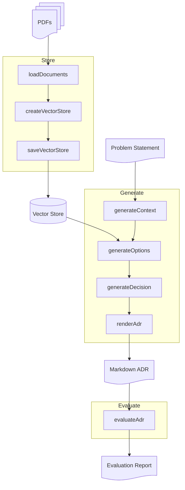

# Step 03: Retrieval-Augmented Generation

**Branch**: `step-03-retrieval-augmented-generation`  
**Goal**: Generate ADR options using retrieval-augmented context from provided AWS PDFs, then complete the chain with existing Step 02 decision and render stages. Uses the same evaluation schema as Steps 01 - 02.

---

## ⚡ TL;DR

Load PDFs into a vector store (persisted to disk), retrieve the most relevant chunks for your decision context, and feed them into options generation. Run the full chain: `context-02 → options-03 → decision-02 → render`, then evaluate with the same rubric as Steps 01 - 02.

---

## 🎯 Learning Outcomes

By the end of this step, you will be able to:

- Load and chunk PDFs, embed them, and perform top-k similarity search with LangChain.
- Augment prompts with retrieved context while keeping structured outputs validated by Zod.
- Run a retrieval-augmented chain that reuses existing evaluation to compare quality across steps.

---

## 🧠 Background

**Why this matters:** Retrieval grounds the LLM in a real context. You keep the familiar Generate → Evaluate → Iterate loop, but with better inputs.  
**Key ideas**

- Retrieval adds context; evaluation stays the same (clarity, justified, comprehensive, actionable).
- Keep it simple: vector store persisted to disk, top-k search, no reranking.
- Follow-along git tutorial; confidence builder, not a test.

---

## 📊 Workflow Diagram



---

## 🔑 Prerequisites

- PDFs placed at `docs/source-pdfs/` directory. Download the following PDFs and place them in this directory:
  - [Cloud design patterns, architectures, and implementations](https://docs.aws.amazon.com/pdfs/prescriptive-guidance/latest/cloud-design-patterns/cloud-design-patterns.pdf)
  - [Agentic AI patterns and workflows on AWS](https://docs.aws.amazon.com/pdfs/prescriptive-guidance/latest/agentic-ai-patterns/agentic-ai-patterns.pdf)
  - [AWS Well-Architected Framework](https://docs.aws.amazon.com/pdfs/wellarchitected/latest/framework/wellarchitected-framework.pdf)
  - [Modernizing the Amazon Database Infrastructure](https://d1.awsstatic.com/whitepapers/modernizing-amazon-database-infrastructure.pdf)

- `.env` configured with:
  - `OLLAMA_MODEL`
  - `OLLAMA_MODEL_JUDGE`
  - `OLLAMA_MODEL_EMBED` (e.g., `nomic-embed-text`)
- Dependencies installed (`yarn install`)
- Ollama running (`curl -f http://localhost:11434/api/version`)
- Branch: `git checkout step-03-retrieval-augmented-generation`

---

## 🧭 Walkthrough

### 1. Load and build the vector store (happens on first retrieval)

- Retrieval is lazy-initialised by `options-03`. On first run, the vector store is built from PDFs and saved to disk in the `.vectorstore/` directory. Subsequent runs load the existing store (faster). Ensure PDFs exist at the paths above.

### 2. Generate the ADR with RAG

```bash
yarn adr generate-03 src/step01/__fixtures__/example-context.md
```

**Expected:** ADR saved to `docs/decisions/drafts/NNNN-*.md` using RAG-backed options. Filename is printed on success.

**Implementation notes**

- Vector store is lazy-initialised and persisted to disk. First run builds it; subsequent runs load it from `.vectorstore/` directory (faster). Expect a slower first call while the store is built.
- PDFs must remain at `docs/source-pdfs/` for the loader to work.

### 3. Evaluate with the same rubric

```bash
yarn adr evaluate docs/decisions/drafts/NNNN-*.md
```

**Expected:** Evaluation saved to `docs/decisions/drafts/NNNN-*.eval.md` with scores: clarity, justified, comprehensive, actionable.

### 4. Compare against Steps 01 - 02

- Open the ADR and its eval; compare to Step 01 (one-shot) and Step 02 (chain) outputs.
- Did RAG improve comprehensive or actionable scores? What changed?

---

## ✅ Checklist

- ⬜ PDFs present in `docs/source-pdfs/` (minimum: `cloud-design-patterns.pdf`, `agentic-ai-patterns.pdf`; additional PDFs enhance retrieval quality)
- ⬜ ADR generated via `yarn adr generate-03 ...` (file exists in `docs/decisions/drafts/`)
- ⬜ Evaluation generated via `yarn adr evaluate ...` with same rubric (clarity, justified, comprehensive, actionable)
- ⬜ Retrieved context is visible in the options prompt (check logs or prompt composition if needed)
- ⬜ I can explain how retrieval changed the options compared to Step 02

---

## 🛠️ Troubleshooting

- **PDF not found** → Ensure files are in `docs/source-pdfs/` with exact filenames above. Paths are case-sensitive; rerun after placing files.
- **Slow or first-run delay** → Vector store builds on first retrieval; subsequent runs are faster.
- **Validation errors** → Check that prompts align with schemas; confirm retrieved context isn’t malformed.
- **Ollama connection errors** → `curl -f http://localhost:11434/api/version`; ensure models are pulled.

---

## ➡️ Next

- Iterate on prompt augmentation: adjust how retrieved snippets are formatted or limited.
- Try different `k` values in retrieval for quality vs. conciseness.
- Apply the same pattern to your own PDFs or knowledge base.
